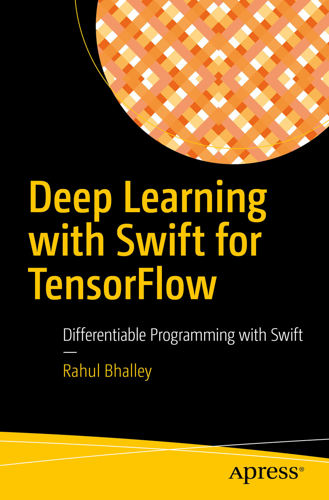

# Deep Learning with Swift for TensorFlow 📖
Official source code repository for "[Deep Learning with Swift for TensorFlow](https://link.springer.com/book/10.1007%2F978-1-4842-6330-3)" book.

[](https://link.springer.com/book/10.1007%2F978-1-4842-6330-3)

**🛍 @ Amazon ([Paperback](https://www.amazon.com/Deep-Learning-Swift-TensorFlow-Differentiable/dp/1484263294/ref=sr_1_1?dchild=1&keywords=rahul+bhalley&qid=1620468163&sr=8-1) / [Kindle](https://www.amazon.com/Deep-Learning-Swift-TensorFlow-Differentiable-ebook/dp/B08T24JX6F/ref=tmm_kin_swatch_0?_encoding=UTF8&qid=1620468163&sr=8-1)) / [ Books](https://books.apple.com/us/book/deep-learning-with-swift-for-tensorflow/id1548806893) / [Apress](https://www.apress.com/us/book/9781484263297) / [SpringerLink](https://link.springer.com/book/10.1007%2F978-1-4842-6330-3)**

## Book Details

### About this book

Discover more insight about deep learning algorithms with Swift for TensorFlow. The Swift language was designed by Apple for optimized performance and development whereas TensorFlow library was designed by Google for advanced machine learning research. Swift for TensorFlow is a combination of both with support for modern hardware accelerators and more. This book covers the deep learning concepts from fundamentals to advanced research. It also introduces the Swift language for beginners in programming. This book is well suited for newcomers and experts in programming and deep learning alike. After reading this book you should be able to program various state-of-the-art deep learning algorithms yourself.

The book covers foundational concepts of machine learning. It also introduces the mathematics required to understand deep learning. Swift language is introduced such that it allows beginners and researchers to understand programming and easily transit to Swift for TensorFlow, respectively. You will understand the nuts and bolts of building and training neural networks, and build advanced algorithms.

### What You’ll Learn

- Understand deep learning concepts
- Program various deep learning algorithms
- Run the algorithms in cloud

### Who This Book Is For

- Newcomers to programming and/or deep learning, and experienced developers.
-  Experienced deep learning practitioners and researchers who desire to work in user space instead of library space with a same programming language without compromising the speed.

## Table of Contents

<!--
<details>
  <summary>Show book's contents</summary>
-->

### About the Author

### About the Technical Reviewer

### Preface

### Chapter 1: Machine Learning Basics

&emsp;1.1 Machine Learning

&emsp;&emsp;1.1.1 Experience

&emsp;&emsp;1.1.2 Task

&emsp;&emsp;1.1.3 Performance Measure

&emsp;1.2 Machine Learning Paradigms

&emsp;&emsp;1.2.1 Supervised Learning

&emsp;&emsp;1.2.2 Unsupervised Learning

&emsp;&emsp;1.2.3 Semi-supervised Learning

&emsp;&emsp;1.2.4 Reinforcement Learning 

&emsp;1.3 Maximum Likelihood Estimation

&emsp;1.4 Elements of a Machine Learning Algorithm

&emsp;&emsp;1.4.1 Data

&emsp;&emsp;1.4.2 Models

&emsp;&emsp;1.4.3 Loss Function

&emsp;&emsp;1.4.4 Optimizer

&emsp;&emsp;1.4.5 Regularizer

&emsp;1.5 Bias and Variance Trade-Off

&emsp;1.6 Why Deep Learning?

&emsp;&emsp;1.6.1 Curse of Dimensionality

&emsp;&emsp;1.6.2 Invalid Smoothness Assumption

&emsp;&emsp;1.6.3 Deep Learning Advantages

&emsp;1.7 Summary

### Chapter 2: Essential Math

&emsp;2.1 Linear Algebra

&emsp;&emsp;2.1.1 Matrices and Vectors

&emsp;&emsp;2.1.2 Unary Matrix Operations

&emsp;&emsp;2.1.3 Binary Matrix Operations

&emsp;&emsp;2.1.4 Norms

&emsp;2.2 Probability Theory

&emsp;&emsp;2.2.1 Joint Probability

&emsp;&emsp;2.2.2 Conditional Probability

&emsp;&emsp;2.2.3 Elementary Rules

&emsp;&emsp;2.2.4 Chain Rule

&emsp;&emsp;2.2.5 Bayes Rule

&emsp;2.3 Differential Calculus

&emsp;&emsp;2.3.1 Function

&emsp;&emsp;2.3.2 Differentiation of Univariate Function

&emsp;&emsp;2.3.3 Differentiation of Multivariate Function

&emsp;&emsp;2.3.4 Differentiation of Vector Function

&emsp;&emsp;2.3.5 Differentiation of Matrix Function

&emsp;2.4 Summary

### Chapter 3: Differentiable Programming

&emsp;3.1 Swift is Everywhere

&emsp;3.2 Swift for TensorFlow

&emsp;3.3 Algorithmic Differentiation

&emsp;&emsp;3.3.1 Programming Approaches

&emsp;&emsp;3.3.2 Accumulation Modes

&emsp;&emsp;3.3.3 Implementation Approaches

&emsp;3.4 Swift Language

&emsp;&emsp;3.4.1 Values

&emsp;&emsp;3.4.2 Collections

&emsp;&emsp;3.4.3 Control Flow

&emsp;&emsp;3.4.4 Closures and Functions

&emsp;&emsp;3.4.5 Custom Types

&emsp;&emsp;3.4.6 Modern Features

&emsp;&emsp;3.4.7 Error Handling

&emsp;&emsp;3.4.8 Advanced Operators

&emsp;&emsp;3.4.9 Differentiation

&emsp;3.5 Python Interoperability

&emsp;3.6 Summary

### Chapter 4: TensorFlow Basics

&emsp;4.1 Tensor

&emsp;4.2 Dataset Loading

&emsp;&emsp;4.2.1 Epochs and Batches

&emsp;4.3 Defining Model

&emsp;&emsp;4.3.1 Neural Network Protocols

&emsp;&emsp;4.3.2 Sequence of Layers

&emsp;4.4 Training and Testing

&emsp;&emsp;4.4.1 Checkpointing

&emsp;&emsp;4.4.2 Model Optimization

&emsp;&emsp;4.4.3 TrainingLoop

&emsp;4.5 From Scratch for Research

&emsp;&emsp;4.5.1 Layer

&emsp;&emsp;4.5.2 Activation Function

&emsp;&emsp;4.5.3 Loss Function

&emsp;&emsp;4.5.4 Optimizer

&emsp;4.6 Summary

### Chapter 5: Neural Networks

&emsp;5.1 Gradient-Based Optimization

&emsp;&emsp;5.1.1 Maxima, Minima, and Saddle Points

&emsp;&emsp;5.1.2 Input Optimization

&emsp;&emsp;5.1.3 Parameters Optimization

&emsp;5.2 Linear Models

&emsp;&emsp;5.2.1 Regression

&emsp;&emsp;5.2.2 Classification

&emsp;5.3 Deep Neural Network

&emsp;&emsp;5.3.1 Dense Neural Network

&emsp;5.4 Activation Functions

&emsp;&emsp;5.4.1 Sigmoid

&emsp;&emsp;5.4.2 Softmax

&emsp;&emsp;5.4.3 ReLU

&emsp;&emsp;5.4.4 ELU

&emsp;&emsp;5.4.5 Leaky ReLU

&emsp;&emsp;5.4.6 SELU

&emsp;5.5 Loss Functions

&emsp;&emsp;5.5.1 Sum of Squares

&emsp;&emsp;5.5.2 Sigmoid Cross-Entropy

&emsp;&emsp;5.5.3 Softmax Cross-Entropy

&emsp;5.6 Optimization

&emsp;&emsp;5.6.1 Gradient Descent

&emsp;&emsp;5.6.2 Momentum

&emsp;5.7 Regularization

&emsp;&emsp;5.7.1 Dataset

&emsp;&emsp;5.7.2 Architecture

&emsp;&emsp;5.7.3 Loss Function

&emsp;&emsp;5.7.4 Optimization

&emsp;5.8 Summary

### Chapter 6: Computer Vision

&emsp;6.1 Convolutional Neural Network

&emsp;&emsp;6.1.1 Convolution Layer

&emsp;&emsp;6.1.2 Dimensions Calculation

&emsp;&emsp;6.1.3 Pooling Layer

&emsp;&emsp;6.1.4 Upsampling

&emsp;6.2 Prominent Features

&emsp;&emsp;6.2.1 Local Connectivity

&emsp;&emsp;6.2.2 Parameter Sharing

&emsp;&emsp;6.2.3 Translation Equivariance

&emsp;6.3 Shortcut Connection

&emsp;6.4 Image Recognition

&emsp;6.5 Conclusion

### References

### Index

<!--
</details>
-->

<hr>

## Setup

- First, you should install the latest Swift for TensorFlow [toolchain](https://github.com/tensorflow/swift/blob/main/Installation.md#releases).
- But to run only differentiation-specific code (for instance, the source code of Differentiable Programming chapter) not requiring deep learning features, simply install the latest Swift toolchain snapshot from [Swift.org](https://swift.org/download/#snapshots) under Trunk Development (main) section. (_The future differentiation feature updates will be posted on this website and will go through the standard [Swift Evolution process](https://forums.swift.org/t/differentiable-programming-for-gradient-based-machine-learning/42147)._)
- Then you must select the newly installed toolchain in Xcode from `Preferences (Command + ,) > Components > Toolchains > (Swift for TensorFlow or Swift Development Snapshot)`.

<hr>

## Executable Source Code

This Swift package offers various executable targets listed in [Package.swift](https://github.com/rahulbhalley/deep-learning-with-swift-for-tensorflow-book/blob/main/Package.swift).

List of all executable targets:

#### `DifferentiableProgramming`
- `AdvancedOperators`
- `AlgorithmicDifferentiation`
- `Arrays`
- `Classes`
- `Closures`
- `ConditionalStatements`
- `ControlTransfer`
- `Dictionaries`
- `Differentiation`
- `EarlyExit`
- `Enumerations`
- `ErrorHandling`
- `Extensions`
- `Generics`
- `GlobalFunctions`
- `Loops`
- `NestedFunctions`
- `Protocols`
- `PythonInteroperability`
- `Sets`
- `Structures`
- `Values`

#### `TensorFlowBasics`
- `EpochAndBatches`
- `FromScratchForResearch`
- `ModelDefinition`
- `TensorExplanation`
- `TrainingAndTesting`
- `TrainingLoopExample`

#### `NeuralNetworks`
- `InputOptimization`
- `LinearRegression`
- `ParametersOptimization`
- `PolynomialRegression`

#### `ComputerVision`
- `ImageRecognition`

### Running in Xcode

Select the executable target (for instance, `AlgorithmicDifferentiation`) from the scheme drop-down menu and then click the Run button. And result should be presented in the console.

### Running in Terminal

To execute any of them first enter into this package's root directory.
```
cd deep-learning-with-swift-for-tensorflow-book
```

Then run the following command in terminal.
```
swift run AlgorithmicDifferentiation
```

The following output will be displayed.
```
expression value: 30.0
expression derivative: 28.0
```

Just replace `AlgorithmicDifferentiation` with any executable target you wish to run.

<hr>

**Note**: This Swift package was tested on Xcode 12.5 running on macOS version 11.3. It should also work right out of the box on Linux distributions.

## Contact

📫  [rahulbhalley@icloud.com](mailto:rahulbhalley@icloud.com)
